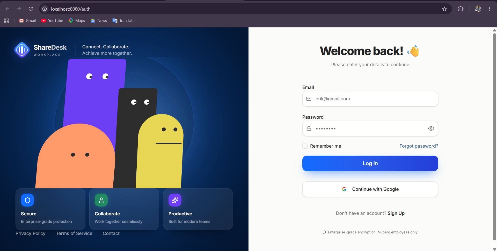
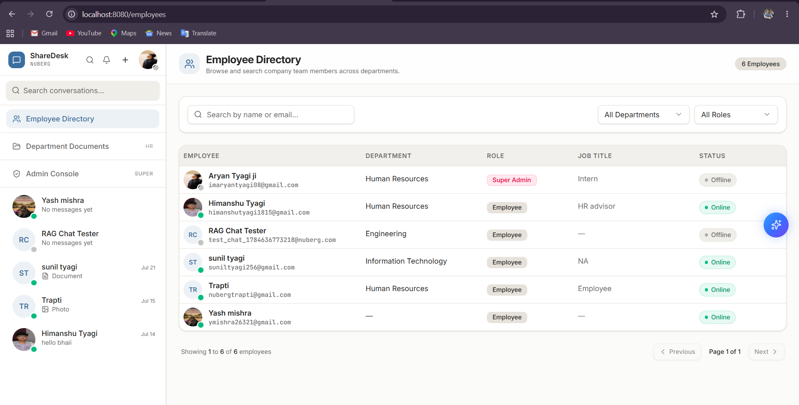
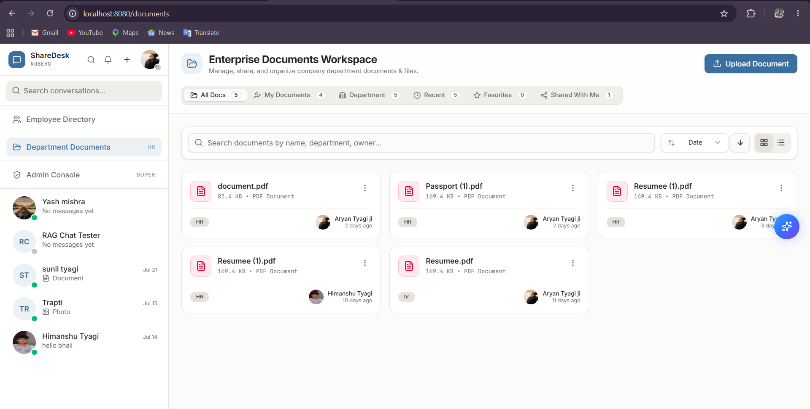
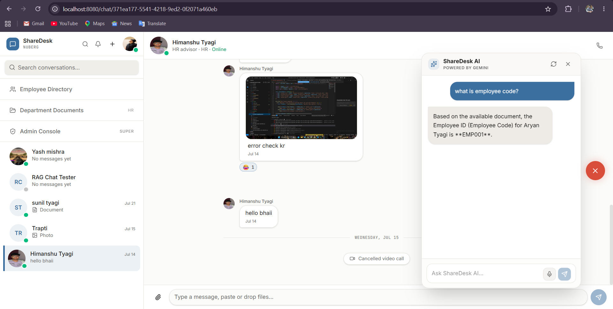
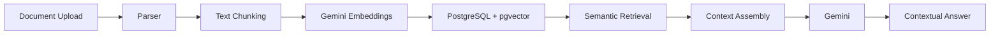
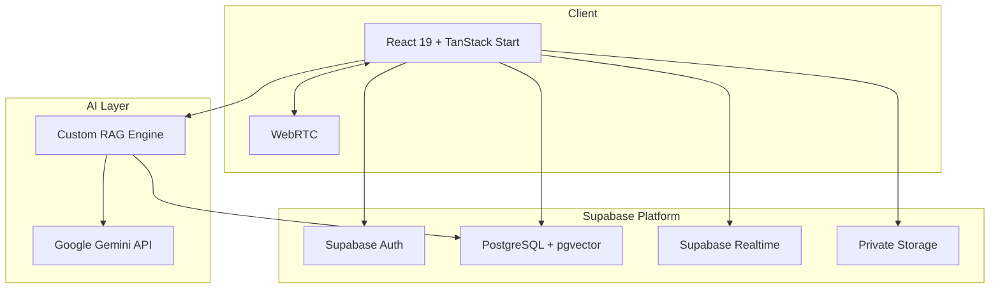
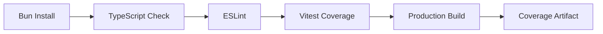

# ShareDesk

### Enterprise Digital Workplace & AI Collaboration Platform

[](https://github.com/aryanty4gi/Sharedeskkkk/actions/workflows/ci.yml)


**ShareDesk** is a full-stack enterprise digital workplace and AI collaboration platform built to bring communication, people, documents, administration, and organizational knowledge into one secure workspace.

It combines real-time messaging, employee management, document collaboration, WebRTC video calling, enterprise search, and a Gemini-powered Retrieval-Augmented Generation (RAG) assistant for contextual knowledge retrieval.

---

## Project Status

| Area | Status |
| --- | --- |
| Release | `v1.0.0` |
| CI | Passing |
| Automated Tests | 23 / 23 passing |
| Test Suites | 6 / 6 passing |
| TypeScript | 0 errors |
| ESLint | 0 errors |
| Production Build | Verified |

---

## Product Preview

### Authentication

Secure enterprise authentication with email/password and Google OAuth.



### Employee Directory

Searchable company employee directory with department and role filtering, presence indicators, and employee information.



### Enterprise Documents Workspace

Department-aware document management with search, filtering, private storage, document organization, and RAG ingestion.



### ShareDesk AI Assistant

Gemini-powered enterprise knowledge assistant integrated directly into the collaboration workspace, using Retrieval-Augmented Generation to retrieve contextual information from authorized company documents.



---

## Key Features

- **Enterprise Employee Directory** — Searchable and filterable workforce directory with department, role, and presence information.
- **Employee Profile Drawer** — Detailed employee profiles with organizational information and communication actions.
- **Enterprise Documents Workspace** — Centralized document management with search, sorting, organization, favorites, private storage, and AI ingestion.
- **Real-Time Chat** — Workplace messaging with replies, reactions, attachments, and real-time updates powered by Supabase.
- **WebRTC Video Calling** — Peer-to-peer video communication integrated directly into the collaboration workspace.
- **Global Search (`Ctrl/Cmd + K`)** — Unified search across employees, documents, and conversations.
- **Enterprise Admin Dashboard** — Administrative dashboard with KPIs, workforce analytics, recent activity, and management actions.
- **Authentication & RBAC** — Authentication and role-based authorization for enterprise users.
- **Supabase Row Level Security** — Database-level policies protecting access to organizational data.
- **Secure Private File Storage** — Private Supabase Storage with authenticated, short-lived signed URLs.
- **Gemini AI Assistant** — Integrated AI assistant for workplace knowledge queries.
- **RAG Document Ingestion** — Uploaded documents are parsed, chunked, embedded, and indexed for semantic retrieval.
- **pgvector Semantic Search** — PostgreSQL vector similarity search for relevant document context.
- **Adaptive Retrieval** — Retrieval automatically evaluates similarity thresholds to find useful document chunks.
- **Department-Aware Retrieval** — Knowledge retrieval is scoped according to department and application permissions.

---

## RAG Architecture

ShareDesk contains a custom Retrieval-Augmented Generation pipeline that converts enterprise documents into searchable organizational knowledge.



### Vector Embeddings

- **Embedding Model:** `gemini-embedding-001`
- **Vector Dimensions:** `768`
- **Vector Storage:** PostgreSQL with `pgvector`
- **Retrieval Strategy:** Semantic similarity with adaptive thresholds
- **Access Scope:** Department-aware retrieval

> **OCR limitation:** Image-only PDFs are not currently guaranteed to provide extractable text. OCR is not part of the current RAG ingestion pipeline.

For complete implementation details, see [RAG Documentation](docs/RAG.md).

---

## System Architecture



Detailed system design is available in [Architecture Documentation](docs/ARCHITECTURE.md).

---

## Technology Stack

| Layer | Technologies |
| --- | --- |
| Frontend | React 19, TypeScript, TanStack Start, TanStack Router |
| Data Fetching | TanStack Query |
| Styling | Tailwind CSS v4 |
| UI | Radix UI, Lucide Icons |
| Backend Platform | Supabase |
| Database | PostgreSQL |
| Authentication | Supabase Auth |
| Realtime | Supabase Realtime |
| Storage | Supabase Storage |
| AI | Google Gemini |
| Embeddings | `gemini-embedding-001` |
| Vector Search | `pgvector` |
| Video Communication | WebRTC |
| Runtime / Package Manager | Bun |
| Bundler | Vite |
| Testing | Vitest, React Testing Library |
| Code Quality | TypeScript, ESLint |
| CI | GitHub Actions |

---

## Security

ShareDesk implements multiple application and infrastructure security controls:

- Authenticated protected routes
- Server-side authentication validation
- Role-Based Access Control (RBAC)
- Supabase Row Level Security policies
- Resource ownership verification
- Department-aware authorization
- Private Supabase Storage
- Short-lived signed file URLs
- Server-only privileged credentials
- File size validation
- MIME/type validation
- Dangerous extension rejection
- Filename sanitization

Sensitive credentials such as `SUPABASE_SERVICE_ROLE_KEY` and `GEMINI_API_KEY` remain server-side and must never be exposed to the browser.

---

## Testing

The current automated testing suite contains:

- **23 automated tests**
- **6 test suites**
- Unit tests
- Component tests
- Server/action tests
- RAG utility tests
- File security validation tests

Run the test suite:

```bash
bun run test
```

Run with coverage:

```bash
bun run test:coverage
```

---

## Continuous Integration

Every push and pull request to `main` is validated through GitHub Actions.



The CI pipeline validates dependency installation, TypeScript correctness, linting, automated tests, coverage generation, and production build generation.

---

## Local Development

### Prerequisites

- **Node.js:** `v22+`
- **Bun:** `v1.x`
- **Supabase project**
- **Google Gemini API access**

### 1. Clone Repository

```bash
git clone https://github.com/aryanty4gi/Sharedeskkkk.git
cd Sharedeskkkk
```

### 2. Install Dependencies

```bash
bun install
```

### 3. Configure Environment

Create a `.env` file in the project root:

```env
SUPABASE_PROJECT_ID="your-supabase-project-id"

SUPABASE_URL="https://your-project.supabase.co"
SUPABASE_PUBLISHABLE_KEY="your-supabase-publishable-key"

VITE_SUPABASE_URL="https://your-project.supabase.co"
VITE_SUPABASE_PUBLISHABLE_KEY="your-supabase-publishable-key"

SUPABASE_SERVICE_ROLE_KEY="your-supabase-service-role-key"
GEMINI_API_KEY="your-gemini-api-key"
```

> `SUPABASE_SERVICE_ROLE_KEY` and `GEMINI_API_KEY` are privileged server-side secrets. Never expose real values in source control.

### 4. Start Development Server

```bash
bun run dev
```

Open:

`http://localhost:8080/`

---

## Development Verification

```bash
# TypeScript
bunx tsc --noEmit

# ESLint
bun run lint

# Tests
bun run test

# Coverage
bun run test:coverage

# Production build
bun run build
```

---

## Technical Documentation

Detailed engineering documentation is maintained inside the repository:

- [Architecture Documentation](docs/ARCHITECTURE.md)
- [Database Schema & RLS Documentation](docs/DATABASE.md)
- [RAG & AI Engine Documentation](docs/RAG.md)
- [GitHub Project Showcase](docs/SHOWCASE.md)
- [Resume & Impact Metrics](docs/RESUME.md)
- [System Design & Interview Kit](docs/INTERVIEW_KIT.md)

---

## Release

### v1.0.0 — Production Ready

ShareDesk `v1.0.0` represents the first stable enterprise release, including the collaboration platform, security controls, RAG knowledge engine, automated testing suite, CI pipeline, and technical documentation.

[View ShareDesk v1.0.0 Release](https://github.com/aryanty4gi/Sharedeskkkk/releases/tag/v1.0.0)

---

## Repository

**GitHub:**  
https://github.com/aryanty4gi/Sharedeskkkk

---

Built as an end-to-end exploration of modern enterprise collaboration architecture, real-time systems, secure document management, and Retrieval-Augmented Generation.