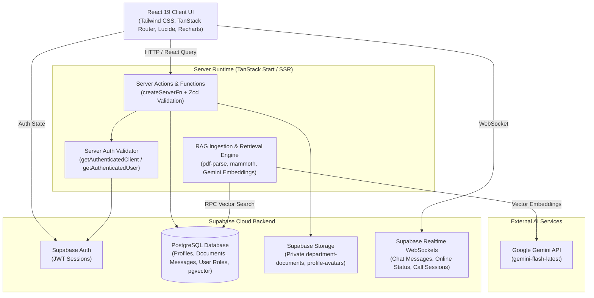

# ShareDesk Enterprise Architecture Documentation

## Executive Overview
**ShareDesk** is an enterprise-grade digital workplace application designed for seamless team collaboration, employee directory management, secure document management workspace, real-time messaging with WebRTC video calling, and an AI assistant powered by Retrieval-Augmented Generation (RAG) and Google Gemini.

The system is built on **TanStack Start**, **React 19**, **Vite**, **TypeScript**, and **Supabase (PostgreSQL, Storage, Realtime, Auth)**.

---

## 1. System Architecture Diagram

---

## 2. Technical Stack & Foundation

| Layer | Technology | Purpose |
| :--- | :--- | :--- |
| **Framework** | TanStack Start + Vite | Full-stack SSR framework with type-safe routing & server functions |
| **UI Library** | React 19 + Tailwind CSS | Modern reactive component architecture with industrial design system |
| **State & Data Fetching** | TanStack React Query + React Router | Server state management, optimistic caching, and URL routing |
| **Backend / Database** | Supabase (PostgreSQL 15+) | Cloud database, authentication, storage buckets, and realtime WS |
| **Vector Engine** | `pgvector` extension | High-performance vector similarity search for document chunks |
| **AI Integration** | Google Gemini API (`@google/genai`) | Intelligent RAG response generation and text embeddings |
| **Realtime Messaging** | Supabase Realtime Channels | WebSocket subscriptions for direct messaging and WebRTC signaling |
| **Testing** | Vitest + Testing Library | Automated unit, component, and server testing suite |
| **CI/CD** | GitHub Actions | Automated build, linting, typechecking, testing, and coverage artifacts |

---

## 3. Core Subsystems

### 3.1 Authentication & Role-Based Access Control (RBAC)
- **Authentication**: JWT-based authentication managed by Supabase Auth.
- **Server-Side Token Validation**: Server functions execute `getAuthenticatedClient(token)` which constructs an isolated Supabase client scoped to the caller's JWT token, validating session expiry.
- **RBAC Roles**: Roles are defined in `public.user_roles`:
  - `super_admin`: Full system administration, role management, user deletion, global file access.
  - `hr_admin`: Employee directory management and onboarding.
  - `department_head`: Department document oversight and team management.
  - `manager`: Direct report management.
  - `employee`: Standard workspace access.

### 3.2 Enterprise Employee Directory
- **Backend Queries (`src/lib/employees/`)**: Paginated employee query with search (by full name and email), department filter, and role filter.
- **Performance**: Row memoization (`React.memo`) and indexed queries to maintain smooth 60fps interaction during searches.

### 3.3 Enterprise Documents Workspace & RAG Knowledge Engine
- **Workspace Navigation**: Categorized views (*My Documents*, *Department*, *Recent*, *Favorites*, *Shared With Me*).
- **RAG Ingestion Pipeline**:
  1. Document Upload: File validated for size and prohibited extensions (`src/lib/security/file-validation.ts`).
  2. Storage: Uploaded to private `department-documents` bucket.
  3. Parsing & Chunking: Parsed via `pdf-parse` or `mammoth` into clean text, then chunked into overlapping segments via `chunkText`.
  4. Vector Embedding: Vector embeddings generated via Gemini Embedding API (`text-embedding-004`).
  5. Vector Storage: Inserted into `document_chunks` table with `pgvector` indexing.

### 3.4 Realtime Chat & WebRTC Video Calling
- **Direct & Group Messaging**: Powered by Supabase Postgres changes on `messages` table.
- **WebRTC Video Signaling**: Peer-to-peer audio/video connection negotiated over Supabase Realtime Channels (`call_sessions` table signaling).

### 3.5 Unified Global Search (`Ctrl+K`)
- **Combined Results**: Simultaneously queries Employees, Department Documents, and Chat Messages in parallel.
- **Optimized Execution**: Scopes auxiliary metadata queries (`user_roles`) exclusively to matching search results.

---

## 4. Security Architecture & Controls

1. **Authentication Enforcement**: Server functions validate session JWT tokens (`token: z.string().min(1)`) prior to database execution.
2. **Resource Ownership Guardrails**: Server actions verify resource ownership (e.g. `msg.sender_id === user.id`) before updating or deleting data.
3. **File Upload Security**: Enforces file size limits (50MB for docs, 25MB for attachments, 5MB for avatars) and rejects executable extensions (`.exe`, `.sh`, `.php`, `.bat`, `.vbs`, etc.).
4. **Secret Isolation**: `SUPABASE_SERVICE_ROLE_KEY` and `GEMINI_API_KEY` are kept exclusively on the server (`client.server.ts`), preventing client bundle leaks.
5. **Prompt Injection Mitigations**: Retrieved context in AI prompts is wrapped in explicit data boundary instructions instructing Gemini to treat retrieved text strictly as reference data, not executable commands.
