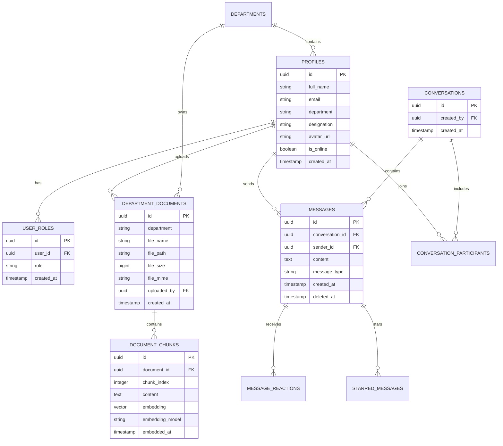

# ShareDesk Enterprise Database Documentation

## Schema Overview
ShareDesk relies on **PostgreSQL (Supabase)** as its core relational data store. It leverages standard relational tables, foreign key constraints, Row Level Security (RLS) policies, database triggers, stored procedures (RPCs), and the `pgvector` extension for vector similarity search.

---

## 1. Entity-Relationship Diagram (ERD)



---

## 2. Table Schemas & Specifications

### 2.1 `public.profiles`
Stores employee user profile information linked directly to `auth.users(id)`.

| Column | Type | Constraints | Description |
| :--- | :--- | :--- | :--- |
| `id` | `uuid` | PK, References `auth.users(id)` | Unique user identifier |
| `full_name` | `text` | Nullable | Employee full name |
| `email` | `text` | NOT NULL, Unique | Employee primary email |
| `department` | `text` | Nullable | Assigned department name |
| `designation` | `text` | Nullable | Employee job title/designation |
| `avatar_url` | `text` | Nullable | Storage path for profile avatar image |
| `is_online` | `boolean` | Default `false` | Realtime online status indicator |
| `created_at` | `timestamptz` | Default `now()` | Account creation timestamp |

### 2.2 `public.user_roles`
Defines role permissions for RBAC enforcement.

| Column | Type | Constraints | Description |
| :--- | :--- | :--- | :--- |
| `id` | `uuid` | PK, Default `gen_random_uuid()` | Unique record ID |
| `user_id` | `uuid` | FK -> `profiles(id)` | Linked employee ID |
| `role` | `text` | Enum (`super_admin`, `hr_admin`, `department_head`, `manager`, `employee`) | Assigned privilege role |

### 2.3 `public.department_documents`
Workspace document records stored in private buckets.

| Column | Type | Constraints | Description |
| :--- | :--- | :--- | :--- |
| `id` | `uuid` | PK, Default `gen_random_uuid()` | Document ID |
| `department` | `text` | NOT NULL | Department owning the document |
| `file_name` | `text` | NOT NULL | Original document filename |
| `file_path` | `text` | NOT NULL, Unique | Storage bucket key path |
| `file_size` | `bigint` | Nullable | Document file size in bytes |
| `file_mime` | `text` | Nullable | MIME type (e.g. `application/pdf`) |
| `uploaded_by` | `uuid` | FK -> `profiles(id)` | Uploader ID |
| `created_at` | `timestamptz` | Default `now()` | Upload timestamp |

### 2.4 `public.document_chunks`
Text chunks and vector embeddings used by the RAG knowledge engine.

| Column | Type | Constraints | Description |
| :--- | :--- | :--- | :--- |
| `id` | `uuid` | PK, Default `gen_random_uuid()` | Chunk ID |
| `document_id` | `uuid` | FK -> `department_documents(id)` ON DELETE CASCADE | Parent document ID |
| `chunk_index` | `integer` | NOT NULL | Sequential chunk position index |
| `content` | `text` | NOT NULL | Extracted document text content |
| `embedding` | `vector(768)` | Nullable | Gemini vector embedding vector |
| `embedding_model` | `text` | Nullable | Model ID used (`text-embedding-004`) |
| `embedded_at` | `timestamptz` | Nullable | Embedding generation timestamp |

---

## 3. Row Level Security (RLS) Policies

### `profiles`
- **SELECT**: `auth.role() = 'authenticated'` (All employees can view colleagues).
- **UPDATE**: `auth.uid() = id` (Employees can only update their own profile).

### `department_documents`
- **SELECT**: `uploaded_by = auth.uid()` OR `department = (SELECT department FROM profiles WHERE id = auth.uid())` OR `(SELECT role FROM user_roles WHERE user_id = auth.uid()) = 'super_admin'`.
- **INSERT**: `auth.role() = 'authenticated' AND uploaded_by = auth.uid()`.
- **DELETE**: `uploaded_by = auth.uid()` OR `(SELECT role FROM user_roles WHERE user_id = auth.uid()) = 'super_admin'`.

### `messages` & `conversations`
- **SELECT / INSERT**: Restricted to users who are active participants in `conversation_participants` (`user_id = auth.uid()`).
- **UPDATE / DELETE**: `sender_id = auth.uid()` (Users can only modify/soft-delete their own messages).

---

## 4. Production Indexing Strategy

Execute the following DDL statements to ensure optimal query performance:

```sql
-- 1. Profiles Table Indexes
CREATE INDEX IF NOT EXISTS idx_profiles_full_name ON public.profiles(full_name);
CREATE INDEX IF NOT EXISTS idx_profiles_email ON public.profiles(email);
CREATE INDEX IF NOT EXISTS idx_profiles_department ON public.profiles(department);

-- 2. Department Documents Table Indexes
CREATE INDEX IF NOT EXISTS idx_dept_docs_uploaded_by ON public.department_documents(uploaded_by);
CREATE INDEX IF NOT EXISTS idx_dept_docs_department ON public.department_documents(department);
CREATE INDEX IF NOT EXISTS idx_dept_docs_created_at ON public.department_documents(created_at DESC);

-- 3. Vector Similarity Search Index (pgvector IVFFlat)
CREATE INDEX IF NOT EXISTS idx_document_chunks_embedding 
ON public.document_chunks 
USING ivfflat (embedding vector_cosine_ops) 
WITH (lists = 100);

-- 4. Messages & User Roles Indexes
CREATE INDEX IF NOT EXISTS idx_messages_conversation_created ON public.messages(conversation_id, created_at DESC);
CREATE INDEX IF NOT EXISTS idx_user_roles_user_id ON public.user_roles(user_id);
```

---

## 5. Vector Similarity Search Stored Procedure (RPC)

```sql
CREATE OR REPLACE FUNCTION match_document_chunks(
  query_embedding vector(768),
  match_threshold float,
  match_count int,
  filter_department text
)
RETURNS TABLE (
  chunk_id uuid,
  document_id uuid,
  chunk_index int,
  content text,
  file_name text,
  doc_department text,
  similarity float
)
LANGUAGE plpgsql
SECURITY DEFINER
AS $$
BEGIN
  RETURN QUERY
  SELECT
    dc.id AS chunk_id,
    dc.document_id,
    dc.chunk_index,
    dc.content,
    dd.file_name,
    dd.department AS doc_department,
    1 - (dc.embedding <=> query_embedding) AS similarity
  FROM document_chunks dc
  JOIN department_documents dd ON dc.document_id = dd.id
  WHERE dd.department ILIKE filter_department
    AND 1 - (dc.embedding <=> query_embedding) >= match_threshold
  ORDER BY dc.embedding <=> query_embedding ASC
  LIMIT match_count;
END;
$$;
```
